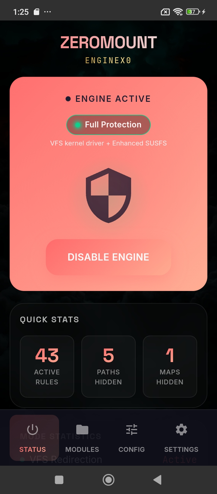
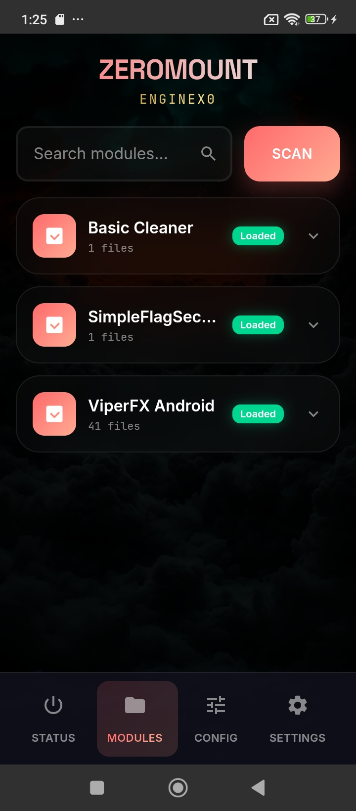
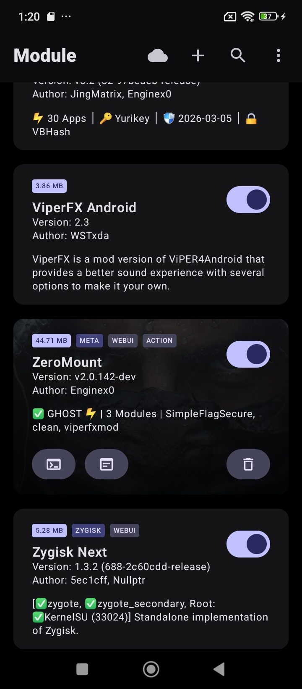
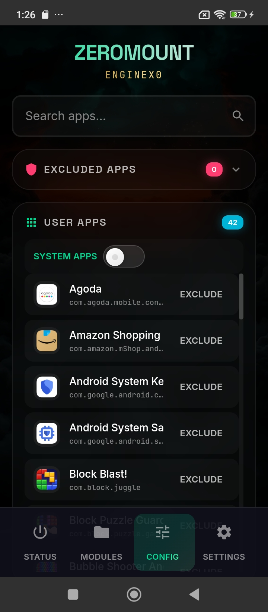
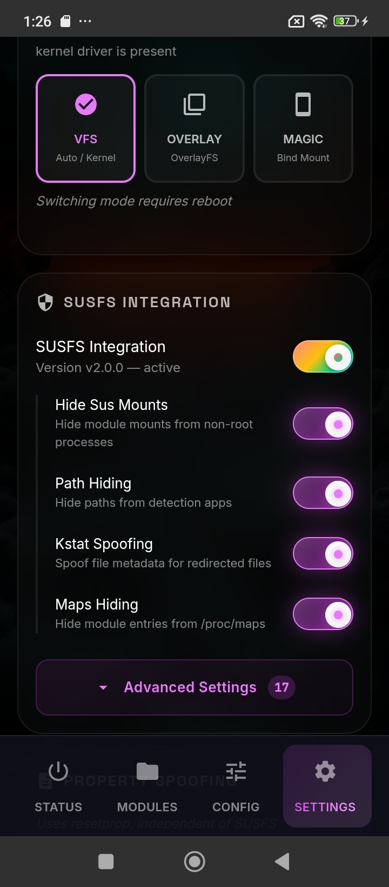
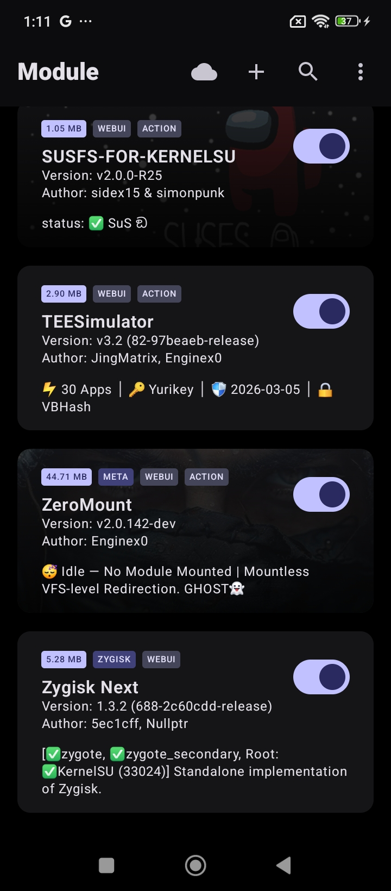

<p align="center">
  <h1 align="center">👻 ZeroMount</h1>
  <p align="center"><b>Mountless Module Loading for Rooted Android</b></p>
  <p align="center">Your modules. Stock mount tables. Zero traces.</p>
  <p align="center">
    
    
    
  </p>
</p>

---

> [!WARNING]
> **ZeroMount is currently in beta and under heavy active development.**
>
> Features are being added, tested, and refined continuously. The core functionality has been tested end-to-end on personal devices, but edge cases are expected — different devices, ROMs, and kernel configurations behave differently across brands and models.
>
> If something breaks, [report it on Telegram](https://t.me/superpowers9) or [open an issue](https://github.com/Enginex0/zeromount/issues). Response times may vary as development is the priority.

---

## 🧬 What is ZeroMount?

ZeroMount is a **ground-up reimplementation** of mountless module loading for rooted Android. Instead of bind mounts or overlayfs — which leave traces in `/proc/mounts` and `/proc/self/mountinfo` — ZeroMount intercepts the kernel's VFS layer directly, redirecting file paths at the `getname()` level before the filesystem even knows something changed.

The result: **module files appear at their stock system paths with absolutely zero mount table pollution**. Detection apps that scan mount tables, stat file metadata, or inspect `/proc/PID/maps` see a completely stock device.

> **This is not a port of NoMount.** ZeroMount shares the same goal — kernel-level VFS redirection without mount pollution — but the architecture is entirely different in every layer: a custom kernel driver, a Rust userspace binary, SUSFS integration, a WebUI, and a multi-phase boot pipeline. Built from scratch.

---

## 📸 Screenshots

<table>
  <tr>
    <td align="center"><br><b>Status Dashboard</b><br>Engine status, live stats, activity log</td>
    <td align="center"><br><b>Module Manager</b><br>Scan, hot-load, and manage modules</td>
    <td align="center"><br><b>GHOST Mode 👻</b><br>ZeroMount active in KSU manager</td>
  </tr>
  <tr>
    <td align="center"><br><b>App Exclusions</b><br>Per-app VFS bypass with search</td>
    <td align="center"><br><b>Settings</b><br>SUSFS toggles, mount engine, themes</td>
    <td align="center"><br><b>KSU Manager</b><br>ZeroMount module status</td>
  </tr>
</table>

---

## 🔥 Why ZeroMount?

🛡️ **Bootloop Protection Built In** — Vol-down during boot triggers safe mode instantly. Three failed boots and your config auto-rolls back to the last working state. Problematic modules get disabled automatically. We've all been there — ZeroMount makes sure you can always recover.

👻 **Truly Invisible Module Loading** — Zero entries in `/proc/mounts`. Zero entries in `/proc/self/mountinfo`. File metadata, SELinux contexts, and filesystem types all match stock. Detection apps see nothing because there's nothing to see.

🎛️ **Full WebUI — No Terminal Needed** — Dashboard with live stats, module manager with hot-load/unload, app exclusion panel, SUSFS controls, theme customization (dark, light, AMOLED). Configure everything from your KSU manager.

🔄 **Strategy Fallback** — VFS redirection is the primary engine, but if your kernel doesn't support it, ZeroMount gracefully falls back to OverlayFS, then MagicMount. Your modules load regardless.

📦 **Metamodule — Manages All Your Modules** — ZeroMount takes over module mounting from your root manager. Install and uninstall KSU modules normally — ZeroMount intercepts, applies VFS rules, and loads everything mountlessly. New module installs, uninstalls, and updates are handled automatically.

🔒 **Deep SUSFS Integration** — Path hiding, kstat spoofing, maps hiding, mount hiding, uname spoofing, cmdline spoofing, and more — all configurable from the WebUI. If you know SUSFS, you know what this means.

---

## ✨ Features

**Core VFS Engine**
- [x] 👻 **VFS path redirection** — module files load at stock system paths, zero mount table entries
- [x] 📂 **Directory entry injection** — module files appear in `ls` and `readdir` like they're stock
- [x] 🔗 **d_path & mmap spoofing** — `/proc/PID/maps` and fd symlinks show clean metadata
- [x] 🏷️ **SELinux context injection** — redirected files carry correct labels, no AVC denials
- [x] 💾 **statfs spoofing** — system partitions report expected EROFS magic
- [x] 🔀 **3 mount strategies** — VFS (preferred) → OverlayFS (fallback) → MagicMount (last resort)

**SUSFS Integration**
- [x] 🛡️ **Deep SUSFS integration** — path hiding, kstat spoofing, mount hiding, maps hiding, uname/cmdline spoofing, and more — all toggleable from the WebUI

**WebUI**
- [x] 📊 **Full WebUI dashboard** — real-time status, module manager with hot load/unload, app exclusion by UID, and a complete settings panel
- [x] 🎨 **Themeable** — dark, light, AMOLED, custom accent colors, glass effects

**Safety & Reliability**
- [x] 🛟 **Bootloop guard** — boot counter + marker thresholds with automatic config rollback and recovery
- [x] 🔽 **Vol-down safe mode** — hold volume down during boot as a hardware escape hatch
- [x] 🤝 **Peer module orchestration** — intercepts other module installs/uninstalls for VFS compatibility
- [x] 💾 **Config backup** — automatic backup before every pipeline run, restored on boot failures

**Extras**
- [x] 😀 **Custom emoji fonts** — replace system emoji with your own NotoColorEmoji
- [x] 🔧 **Property spoofing** — build props, verified boot state, cmdline, uname
- [x] 🥷 **Process camouflage** — ZeroMount process appears as `[kworker/...]` in `ps`
- [x] ⚡ **Performance tuner** — optional CPU/IO governor optimization daemon
- [x] 🔄 **OTA updates** — in-manager update support via `updateJson`
- [x] 🔌 **ADB root** — root shell access in ADB without modifying global system properties

---

## ⚙️ Kernel Interface

ZeroMount communicates with the kernel through two interfaces: a custom miscdevice for VFS control and SUSFS supercalls for hiding features.

### ZeroMount VFS — `/dev/zeromount`

Ioctl commands issued to the ZeroMount miscdevice (magic `0x5A`):

| Ioctl | Code | Description |
|---|---|---|
| `ADD_RULE` | `0x5A01` | Register a VFS path redirection rule |
| `DEL_RULE` | `0x5A02` | Remove a VFS redirection rule |
| `CLEAR_ALL` | `0x5A03` | Clear all active redirection rules |
| `GET_VERSION` | `0x5A04` | Query the driver version |
| `ADD_UID` | `0x5A05` | Exclude a UID from VFS redirection |
| `DEL_UID` | `0x5A06` | Re-include a UID in VFS redirection |
| `GET_LIST` | `0x5A07` | List all active redirection rules |
| `ENABLE` | `0x5A08` | Enable the VFS engine |
| `DISABLE` | `0x5A09` | Disable the VFS engine |
| `REFRESH` | `0x5A0A` | Flush dcache to apply rule changes |
| `GET_STATUS` | `0x5A0B` | Query whether the engine is active |

---

## 📋 Requirements

> [!IMPORTANT]
> ZeroMount's VFS engine requires a **custom kernel** with the ZeroMount driver and SUSFS patches compiled in. Without the patched kernel, the module still works using OverlayFS or MagicMount fallback — but you won't get the mountless VFS redirection that makes ZeroMount special.

**You need:**
1. A rooted Android device with an unlocked bootloader
2. A supported root manager (see compatibility below)
3. A kernel built with ZeroMount + SUSFS patches → **[Super-Builders](https://github.com/Enginex0/Super-Builders)**

---

## 📱 Compatibility

### Tested Kernels

| Android Version | Kernel | Status |
|---|---|---|
| Android 12 | 5.10.209 | ✅ Tested |
| Android 15 | 6.6.66 | ✅ Tested |

### Root Managers

| Manager | Status | Notes |
|---|---|---|
| KernelSU | ✅ Tested | Full metamodule support |
| APatch | ⚠️ Untested | Should work — metamodule hooks present but not verified |
| Magisk | ⚠️ Untested | Fallback mount pipeline exists but not verified on device |

> More kernels and devices will be tested as development continues. If you test on a device/kernel combo not listed here, let us know in the [Telegram group](https://t.me/superpowers9)!

---

## 🚀 Quick Start

1. **Build or download a kernel** with ZeroMount + SUSFS patches from [Super-Builders](https://github.com/Enginex0/Super-Builders)
2. **Flash the kernel** to your device
3. **Install ZeroMount** — download the module ZIP and install via your root manager
4. **Reboot** your device
5. **Open the WebUI** from KSU Manager → ZeroMount → ⚙️

The WebUI will show your engine status, detected kernel capabilities, and loaded modules. Configure SUSFS toggles, app exclusions, and mount strategies from there.

---

## 🔨 Build Your Own Kernel

ZeroMount kernels are built via the **[Super-Builders](https://github.com/Enginex0/Super-Builders)** CI pipeline. It handles patching, compilation, and packaging for supported kernel versions.

If you want to build for a device or kernel version not yet supported, check the repo for the build matrix and open an issue or reach out on Telegram.

---

## 💬 Community

```bash
$ zeromount --connect

 ██████╗ ██████╗ ███╗   ██╗███╗   ██╗███████╗ ██████╗████████╗
██╔════╝██╔═══██╗████╗  ██║████╗  ██║██╔════╝██╔════╝╚══██╔══╝
██║     ██║   ██║██╔██╗ ██║██╔██╗ ██║█████╗  ██║        ██║
██║     ██║   ██║██║╚██╗██║██║╚██╗██║██╔══╝  ██║        ██║
╚██████╗╚██████╔╝██║ ╚████║██║ ╚████║███████╗╚██████╗   ██║
 ╚═════╝ ╚═════╝ ╚═╝  ╚═══╝╚═╝  ╚═══╝╚══════╝ ╚═════╝   ╚═╝

 [✓] SIGNAL    ──→  t.me/superpowers9
 [✓] UPLINK    ──→  kernel builds · bug triage · feature drops
 [✓] STATUS    ──→  OPEN — all operators welcome
```

<p align="center">
  <a href="https://t.me/superpowers9">
    
  </a>
</p>

---

## 🙏 Credits

- **[NoMount](https://github.com/maxsteeel/nomount)** — the project that inspired ZeroMount's approach to mountless module loading
- **[BRENE](https://github.com/rrr333nnn333/BRENE)** — SUSFS automation
- **[Magisk](https://github.com/topjohnwu/Magisk)** by topjohnwu — the root solution that started it all
- **[KernelSU](https://github.com/tiann/KernelSU)** by tiann — next-gen kernel root and module framework

---

## 📄 License

This project is licensed under the [GNU General Public License v3.0](LICENSE).

---

<p align="center">
  <b>👻 GHOST mode — because the best mounts are the ones nobody can find.</b>
</p>
